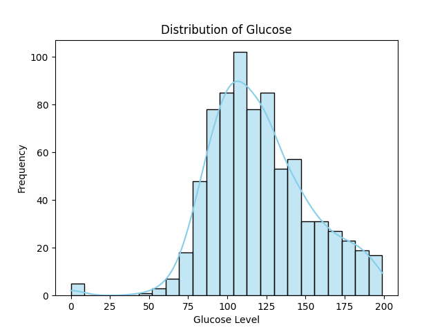
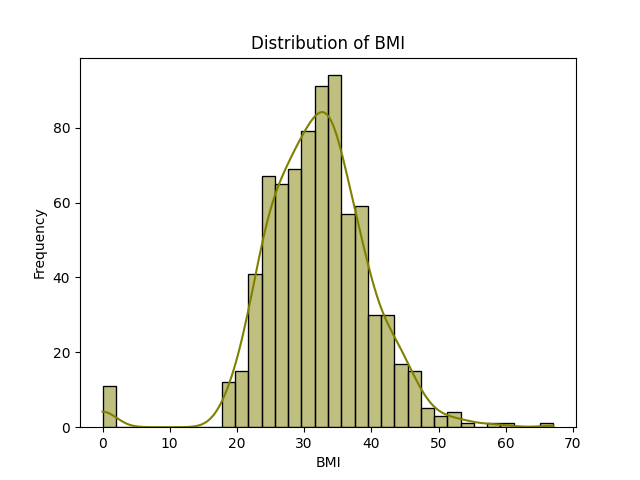
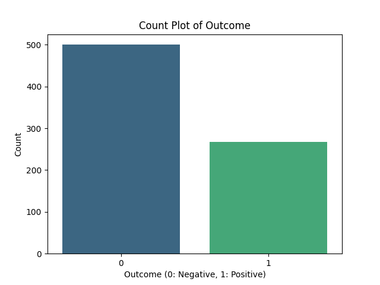

# 🩺 Diabetes Prediction Project

## Overview
This project predicts diabetes using Machine Learning.

## Features
- Data Cleaning
- Data Visualization
- Model Training

## Visualizations

## Tech Stack
- Python
- Pandas
- Scikit-learn

## Author
Karthikeyan

# 🧠 Diabetes Prediction Project

## Overview
This project predicts whether a patient has diabetes using Machine Learning.

## Dataset
- diabetes.csv

## Project Workflow
1. Data Loading
2. Data Cleaning
3. Exploratory Data Analysis (EDA)
4. Feature Scaling
5. Model Training (Logistic Regression)
6. Model Evaluation

## Visualizations

## Model Performance
- Accuracy: XX%

## How to Run

1. Install dependencies:
   pip install -r requirements.txt

2. Run the project:
   python diabetes.py

## Author
Karthikeyan
